# Fable Mode

**Plan in chapters. Prove each scene before the next.**

Fable Mode is an agent skill for Cursor and Claude Code. It turns complex tasks into a
**staged, evidence-backed workflow** — the same way a fable only works when each scene
earns the next.

**Author:** [Mahip Kakan](https://github.com/mahip-kakan)

<p align="center">
  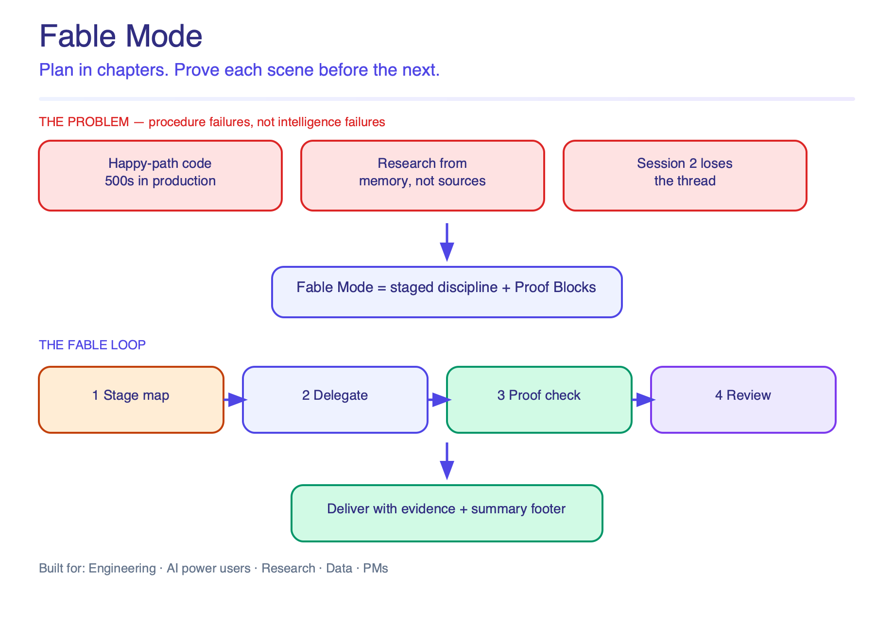
</p>

> **Product thesis:** Agent failures are usually *procedure* failures. Fable Mode adds staged discipline and Proof Blocks — evidence that can fail — without pretending to make the model smarter.

---

## Visual guide

<p align="center">
  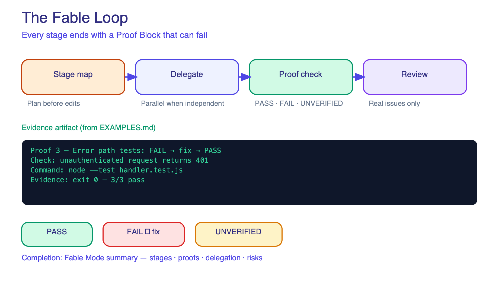
</p>

<p align="center"><em>The Fable Loop — every stage ends with a Proof Block</em></p>

<p align="center">
  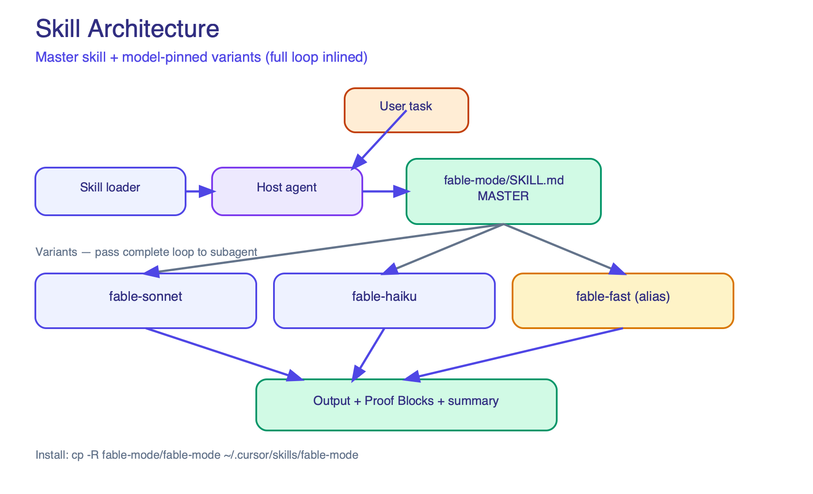
</p>

<p align="center"><em>Master skill + model-pinned variants (full loop inlined)</em></p>

<p align="center">
  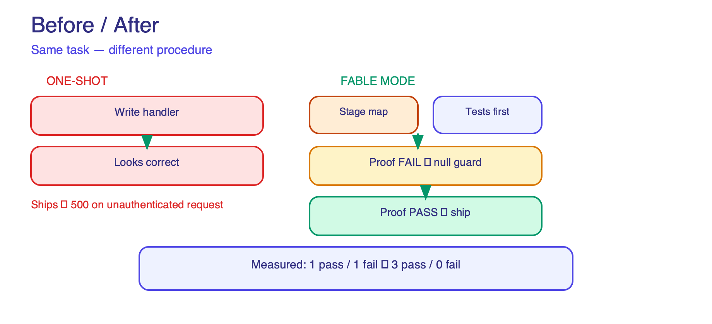
</p>

<p align="center"><em>Measured outcome from the test harness: 1 pass / 1 fail → 3 pass / 0 fail</em></p>

Editable sources: [`docs/diagrams/`](docs/diagrams/) (`.excalidraw`, `.svg`, `.png`)

---

## Table of contents

- [Visual guide](#visual-guide)
- [What is Fable Mode?](#what-is-fable-mode)
- [The core idea](#the-core-idea)
- [Architecture overview](#architecture-overview)
- [The Fable loop (detailed)](#the-fable-loop-detailed)
  - [Step 1 — Stage map](#step-1--stage-map)
  - [Step 2 — Delegate](#step-2--delegate)
  - [Step 3 — Proof check](#step-3--proof-check)
  - [Step 4 — Delivery review](#step-4--delivery-review)
- [Proof Block reference](#proof-block-reference)
- [When to use vs skip](#when-to-use-vs-skip)
- [Domain-specific loops](#domain-specific-loops)
- [Multi-session continuity](#multi-session-continuity)
- [Operational rules](#operational-rules)
- [Skill variants](#skill-variants)
- [How the skill loads at runtime](#how-the-skill-loads-at-runtime)
- [Installation](#installation)
- [Usage examples](#usage-examples)
- [Repository structure](#repository-structure)
- [What Fable Mode does and does not do](#what-fable-mode-does-and-does-not-do)
- [Contributors](#contributors)
- [License](#license)

---

## What is Fable Mode?

Fable Mode is **not** a new AI model and **not** executable software. It is a
**procedure encoded as a skill** (`SKILL.md`) that instructs an agent how to work on
hard tasks:

1. **Plan** before acting (stage map)
2. **Delegate** independent work in parallel when tooling allows
3. **Prove** each stage with evidence that can fail (Proof Block)
4. **Review** output skeptically before delivery

Most agent failures are not intelligence failures — they are **procedure failures**:

| Failure mode | What goes wrong |
|--------------|-----------------|
| Happy-path coding | Code compiles; edge cases 500 in production |
| Research from memory | Claims sound official; sources never read |
| Data analysis | SQL is valid; silent nulls skew results |
| Long tasks | Session 2 guesses where session 1 stopped |

Fable Mode addresses these by making **evidence** a required output at every stage,
not optional narration.

---

## Skill architecture (master + variants)

```text
fable-mode/          ← MASTER — run inline on host model (canonical loop)
fable-sonnet/        ← VARIANT — spawn Sonnet + pass full loop to subagent
fable-haiku/         ← VARIANT — spawn Haiku + pass full loop to subagent
fable-fast/          ← ALIAS  — points to fable-haiku (backward compatibility)
```

| File | Role |
|------|------|
| **`fable-mode/SKILL.md`** | Master skill. Full loop, Proof Blocks, domains, rules. Use for default thorough work on the host model. |
| **`fable-sonnet/SKILL.md`** | Host orchestration + **complete subagent loop inlined** (not a summary). |
| **`fable-haiku/SKILL.md`** | Host orchestration + **complete subagent loop inlined** (not a summary). |
| **`fable-fast/SKILL.md`** | Thin alias — directs to `fable-haiku/SKILL.md`. |

Variant skills **duplicate** the master loop on purpose: subagents do not auto-load
sibling skills, so the host must pass the full instructions. Each variant states
`Master skill: fable-mode/SKILL.md` and inlines the loop so nothing is lost.

---

## The core idea

Think of a complex task as a **fable with chapters**:

```text
  Chapter 1          Chapter 2          Chapter 3          Epilogue
  ─────────          ─────────          ─────────          ────────
  Understand    →    Build         →    Prove         →    Review
  the problem        the solution       it works           & deliver

  Each chapter must EARN the next — not assume it.
```

A one-shot agent answer skips chapters. Fable Mode forces each chapter to produce a
**verifiable artifact** before the story continues.

---

## Architecture overview

How Fable Mode sits in your agent stack:

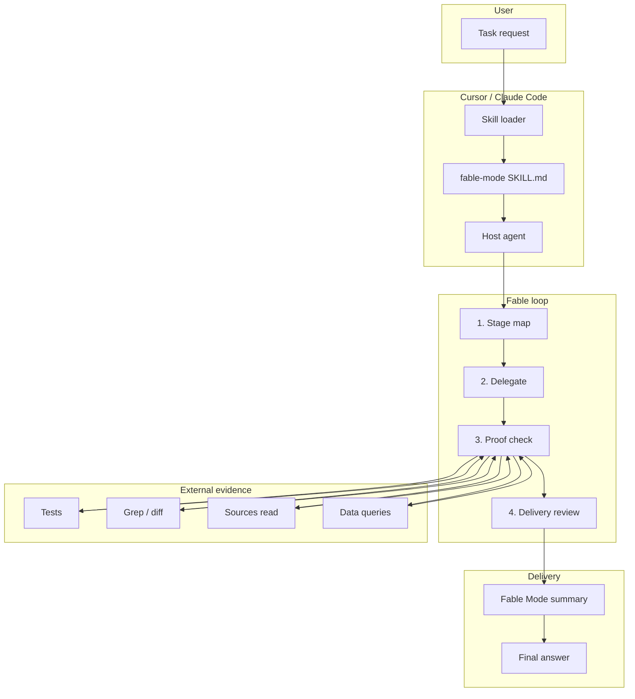

**Key insight:** the skill shapes *procedure*. Evidence lives **outside** the model —
in tests, command output, files, and sources. That is why Proof Blocks matter.

---

## The Fable loop (detailed)

The loop has four steps. Steps 1–3 repeat **per stage**. Step 4 runs once at the end.

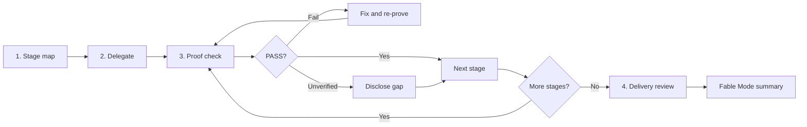

### Step 1 — Stage map

**Purpose:** Surface wrong assumptions *before* expensive work.

Write a numbered plan **before** editing code, querying data, or drafting prose:

```text
Stage 1: Read auth middleware + DB schema → confirm getUser contract
Stage 2: Implement /api/usage handler     → JSON count for authed user
Stage 3: Write tests                      → 401, 200, invalid token
Done when: all tests pass (exit code 0)
```

**Rules:**

- Every stage must produce something **checkable**. If it only produces a feeling, merge
  it with the next stage.
- The map is a **living document** — update it when you learn something that invalidates
  the plan.
- For work spanning multiple chat sessions, start a work log (`FABLE_LOG.md` — see
  [Multi-session continuity](#multi-session-continuity)).

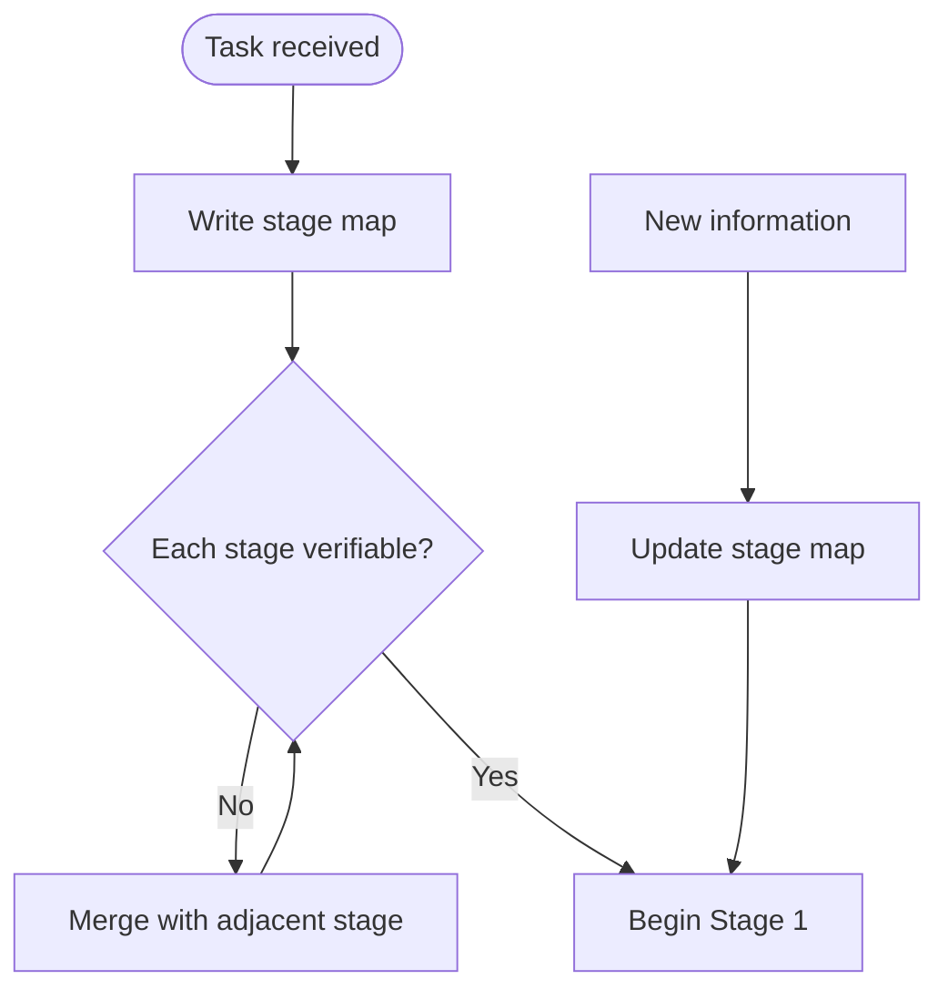

---

### Step 2 — Delegate

**Purpose:** Run independent work in parallel without bloating the main context.

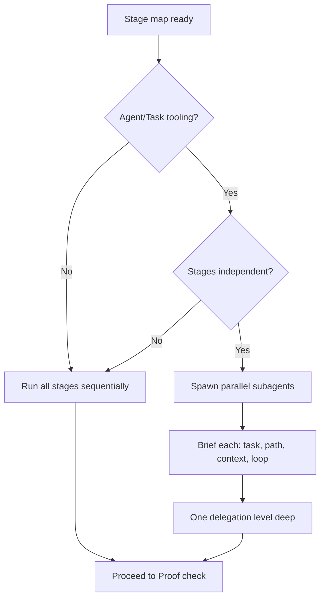

| Scenario | Action |
|----------|--------|
| No subagent tooling | Sequential execution |
| Stages depend on each other | Sequential execution |
| Independent stages (e.g. research + tests) | Parallel subagents |

**Good delegation:** research official docs while implementing test suite.

**Bad delegation:** splitting one function across three agents for show.

**Depth rule:** one level by default. Nested subagents multiply cost and scatter context.

---

### Step 3 — Proof check

**Purpose:** Replace "I think this is correct" with evidence that **can fail**.

Every stage ends with a **Proof Block**:

```text
Proof N — [Stage name]: PASS | FAIL | UNVERIFIED
Check:   [what was verified]
Command: [exact command or tool call, if any]
Evidence:[exit code, output snippet, diff hunk, citation]
```

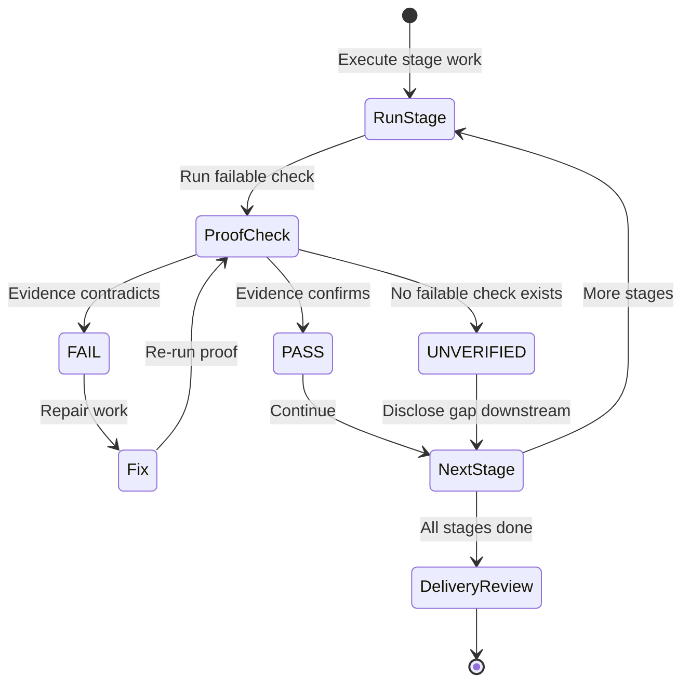

**Acceptable proof:**

| Type | Example evidence |
|------|------------------|
| Test run | `exit 0`, `3/3 pass` |
| Grep / diff | Matching lines quoted |
| Source read | URL + what the source actually says |
| Data query | Row counts, null percentages |
| File shape | Line count, schema validation |

**Not acceptable:**

- "I reviewed it and it looks correct"
- "Tests should pass"
- "The documentation says…" without showing what was read

**Backward loop:** if Stage 4 fixes something that invalidates Stage 2, **re-run Stage 2's
proof** before continuing.

---

### Step 4 — Delivery review

**Purpose:** Catch remaining weaknesses after proofs pass — without manufacturing fake issues.

- Read the final output as a **skeptical reviewer**
- Fix or flag **real** limitations only
- Before raising any issue: **confirm** with grep, diff, run, or read
- If nothing genuine is found, say so plainly

```text
Step 3 = check that CAN fail (external evidence)
Step 4 = judgment about what remains weak AFTER proofs pass
```

Do not invent problems to satisfy the ritual.

---

## Proof Block reference

Copy this template for every stage:

```text
Proof 1 — Read auth contract: PASS
Check:   Confirm getUser returns null (not throw) for missing session
Command: read lib/auth.js + grep "return null"
Evidence: lines 1–5 show explicit null return; no throw on missing auth
```

Status meanings:

| Status | Meaning |
|--------|---------|
| `PASS` | Failable check ran and evidence supports the stage output |
| `FAIL` | Check ran and contradicted output — fix before continuing |
| `UNVERIFIED` | No failable check possible — gap must be visible downstream |

---

## When to use vs skip

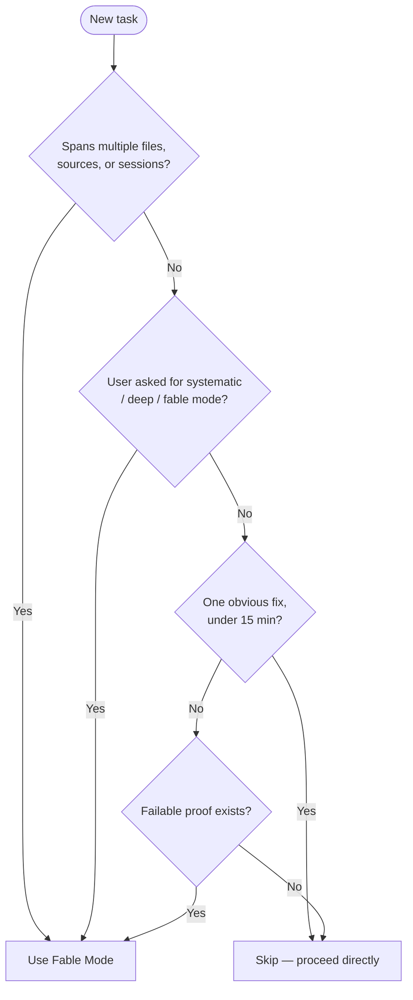

| Use Fable Mode | Skip Fable Mode |
|----------------|-----------------|
| Multi-file refactor | One-line typo fix |
| Research with citations | Quick opinion question |
| Data analysis on real tables | Subjective prose with no check |
| Multi-session project | "Just answer fast" requests |

When skipping, say so in one line and proceed.

---

## Domain-specific loops

Each domain uses the same four steps; **Step 3 (proof)** changes.

### Software engineering

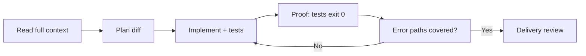

**Proof check:** test suite runs; **error paths** exercised, not just happy path.

---

### Research / knowledge work

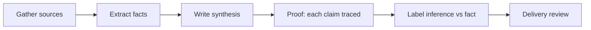

**Proof check:** every load-bearing claim cites a source **actually read**.

Use labels: `[Official Docs]`, `[Third-party]`, `[Community consensus]`, `[Inference]`.

---

### Data analysis

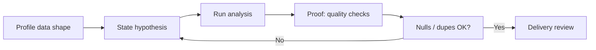

**Proof check:** null rates, duplicate counts, outlier flags **before** reporting aggregates.

---

### Multi-session projects

See [Multi-session continuity](#multi-session-continuity).

---

## Multi-session continuity

Long tasks need memory outside the chat window.

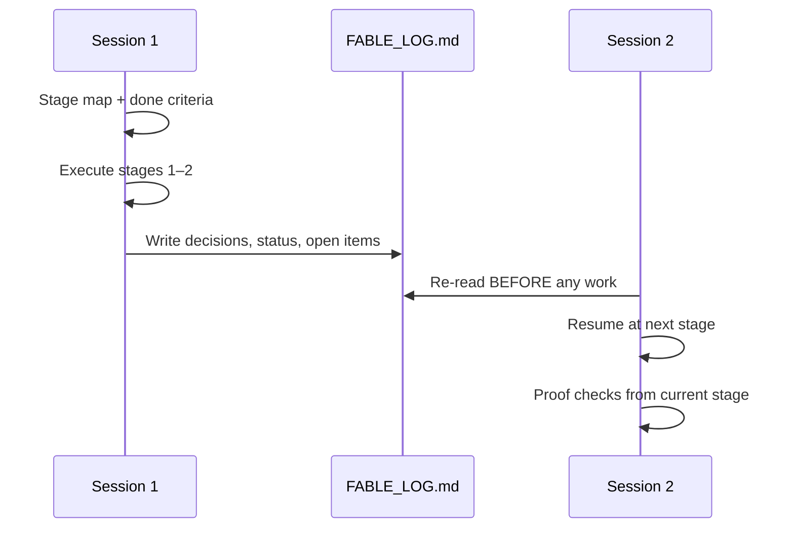

**Work log template** (`FABLE_LOG.md`):

```markdown
# Fable Mode work log

## Done criteria
- [ ] All channels retry on failure (test proof for each)

## Decisions
- 2026-06-21: Retry logic is stage 5, not per-channel

## Stage status
| Stage | Proof | Notes |
|-------|-------|-------|
| 1 | PASS | Interface defined |
| 2 | PASS | Email channel done |

## Open
- SMS SDK choice pending
```

---

## Operational rules

### Warning budget

Minor concerns accumulate. At **3**, stop and surface them together — three small
signals pointing the same direction usually mean one real decision is needed.

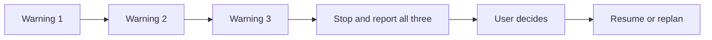

### Replace safety

When using sed or bulk find-and-replace:

- Anchor on word boundaries: `\bterm\b`, not bare `term`
- After replace, grep for corrupted compound words (e.g. `Ledger` mangled by a bare replace)

### Escalation

After **two failed proof attempts** on the same stage, recommend a stronger model or
human review. Do not ship plausible-sounding wrong output.

---

## Skill variants

Three skills share the same loop. They differ in **which model executes the work**.

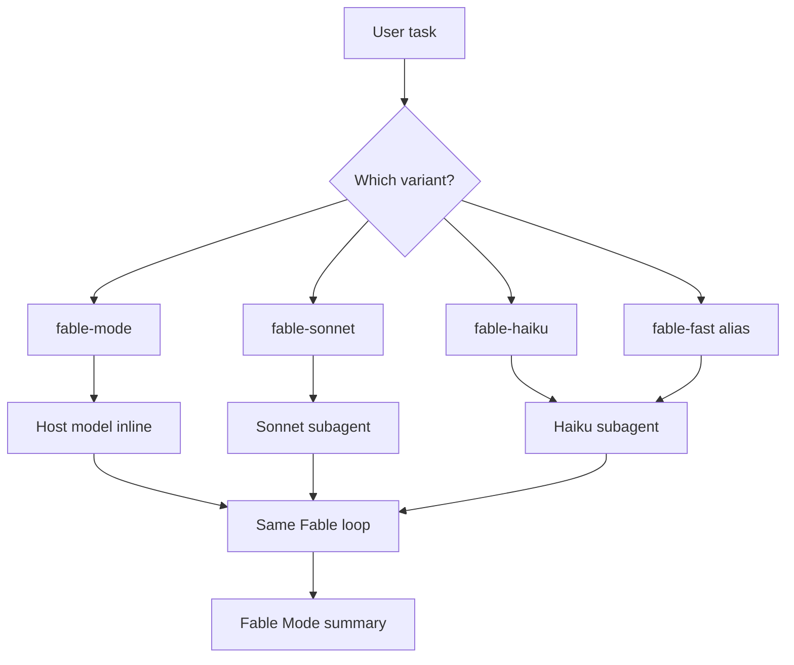

| Skill | Executes on | Best for |
|-------|-------------|----------|
| **`fable-mode`** | Current host model | Default — peak reasoning on hard tasks |
| **`fable-sonnet`** | Sonnet subagent | Balanced cost vs quality |
| **`fable-haiku`** | Haiku subagent | High-volume, structured, cost-sensitive work |
| **`fable-fast`** | Alias → `fable-haiku` | Same as Haiku; kept for backward compatibility |

Each variant inlines the **full subagent loop** from `fable-mode/SKILL.md`. The master
skill is the canonical source; variants add model-specific orchestration.

**Requirements for variants:** Cursor or Claude Code with Agent / Task tooling. Without
it, run `fable-mode` inline on the host model.

---

## How the skill loads at runtime

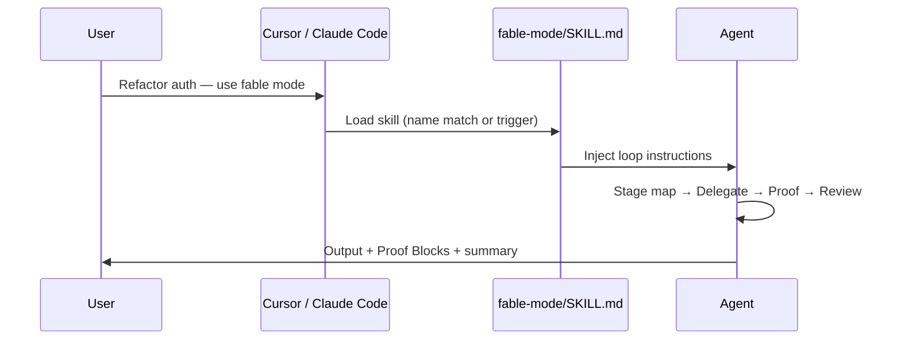

Each skill folder contains one `SKILL.md` with YAML frontmatter:

```yaml
---
name: fable-mode
description: Fable-style agent discipline for complex work...
---
```

The folder name **must match** the `name:` field.

---

## Installation

### Cursor — personal (all projects)

```bash
git clone https://github.com/mahip-kakan/fable-mode.git
cp -R fable-mode/fable-mode ~/.cursor/skills/fable-mode
cp -R fable-mode/fable-sonnet ~/.cursor/skills/fable-sonnet
cp -R fable-mode/fable-haiku ~/.cursor/skills/fable-haiku
cp -R fable-mode/fable-fast ~/.cursor/skills/fable-fast   # optional alias
```

### Cursor — project (team repo)

```bash
mkdir -p .cursor/skills
cp -R fable-mode/fable-mode .cursor/skills/
# optionally add fable-sonnet and fable-haiku
```

### Claude Code

Copy each skill directory into your Claude Code skills path, then invoke by name.

---

## Usage examples

**Explicit invoke (recommended):**

```text
Refactor auth across 5 files — use fable mode.
Proof checks must cover 401 paths. Show Proof Blocks.
```

**Trigger phrases:** `fable mode`, `fable-mode`, `deep work`, `systematic`, `verify each stage`

**Completion footer** (agent should append every run):

```text
Fable Mode summary
Stages: 3 completed
Proofs: 3 pass · 0 fixed · 0 unverified
Delegation: none
Open risks: none
```

**Scored compliance:** if the response has no Proof Blocks, Fable Mode was not actually
followed — regardless of what the agent claimed.

See [EXAMPLES.md](./EXAMPLES.md) for four full before/after scenarios (API bug, research
attribution, SQL nulls, multi-session refactor).

---

## Repository structure

```text
fable-mode/
├── README.md
├── EXAMPLES.md
├── LICENSE
├── docs/diagrams/            ← Excalidraw + PNG product diagrams
├── fable-mode/SKILL.md       ← master skill (canonical loop)
├── fable-sonnet/SKILL.md
├── fable-haiku/SKILL.md
└── fable-fast/SKILL.md       ← alias → fable-haiku
```

---

## What Fable Mode does and does not do

### Does

| Capability | How |
|------------|-----|
| Structures complex work | Stage map before edits |
| Parallelizes independent work | Subagent delegation |
| Catches procedural errors | Proof Blocks with real evidence |
| Preserves multi-session context | Work log + done criteria |
| Makes gaps visible | `UNVERIFIED` status |

### Does not

| Limitation | Why |
|------------|-----|
| Make the model smarter | Procedure ≠ capability |
| Self-enforce | Agent must run commands; skill is instructions only |
| Help trivial tasks | Adds latency and tokens |
| Replace CI or human review | Proof Blocks are agent-side discipline, not production gates |

---

## Contributors

**Mahip Kakan** — author, designer, and maintainer.

- GitHub: [@mahip-kakan](https://github.com/mahip-kakan)

This project was created and is maintained solely by Mahip Kakan.

---

## License

MIT License — see [LICENSE](./LICENSE).

Copyright (c) 2026 Mahip Kakan
